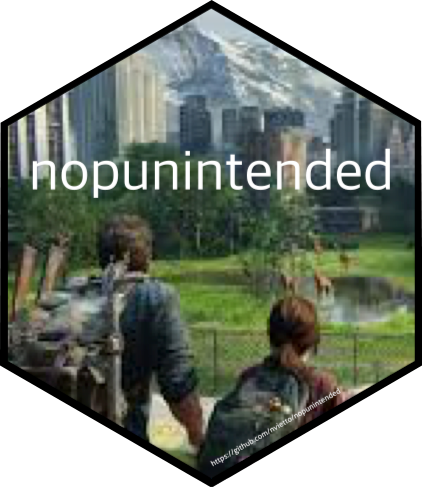

# nopunintended

<!-- badges: start -->
<!-- badges: end -->

{nopunintended} is a package designed to take your mind off coding with puns from ['No Pun Intended: Volume Too'](https://thelastofus.fandom.com/wiki/No_Pun_Intended:_Volume_Too) in the show/video game ['The Last of Us'](https://www.hbo.com/the-last-of-us). 

The code structure and creative inspiration were drawn from the [{meditations}](https://github.com/jacobkap/meditations) package. 

<br>

<p align="center">

</p>


## Installation

You can install the development version of nopunintended from [GitHub](https://github.com/) with:

``` r
# install.packages("devtools")
devtools::install_github("nvietto/nopunintended")
```

## Example

This is a basic example:

``` r
library(nopunintended)

nopunintended()

"I'm reading a book about anti-gravity. It's impossible to put down."

nopunintended(14)

"You know what's not right? (Joel questions, "Left?") (Ellie answers, "Yeah.")"

```

## References 

[The Last of Us - Wikipedia](https://en.wikipedia.org/wiki/The_Last_of_Us)

[The Last of Us - HBO](https://www.hbo.com/the-last-of-us)

[The Last of Us - Games](https://www.playstation.com/en-us/games/the-last-of-us-part-i/)

